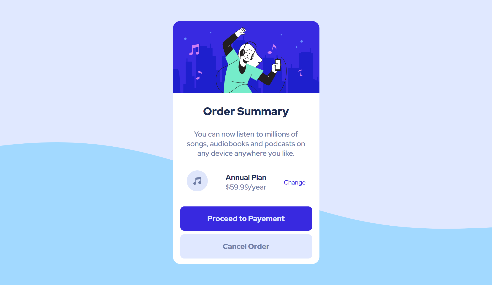

# Frontend Mentor - Order summary card solution

This is a solution to the [Order summary card challenge on Frontend Mentor](https://www.frontendmentor.io/challenges/order-summary-component-QlPmajDUj). Frontend Mentor challenges help you improve your coding skills by building realistic projects.

---

## Table of contents

- [Overview](#overview)
  - [Screenshot](#screenshot)
  - [Links](#links)
- [My process](#my-process)
  - [Built with](#built-with)
  - [What I learned](#what-i-learned)
- [Author](#author)
- [Acknowledgments](#acknowledgments)

---
---

## Overview

### Screenshot

---
---

## My process

### Built with

- Semantic HTML5 markup
- CSS3
- Flexbox

### What I learned

Using efficient class names to remember them easily, don't over complicate/over engineer.

---

### Continued development

Speed-typing without **typos**

---
---

## Author

- Website - [Hatem Soliman](https://www.hatemsoliman.dev/)
- Frontend Mentor - [@CodeNKoffee](https://www.frontendmentor.io/profile/CodeNKoffee)
- Twitter - [@iamsolifuse](https://twitter.com/iamsolifuse)

---
---

## Acknowledgments

Practice coding fast without depending on Emmet so you can learn how to code fast and correctly.

Don't forget to listen to your favourite music while coding, it helps alot!